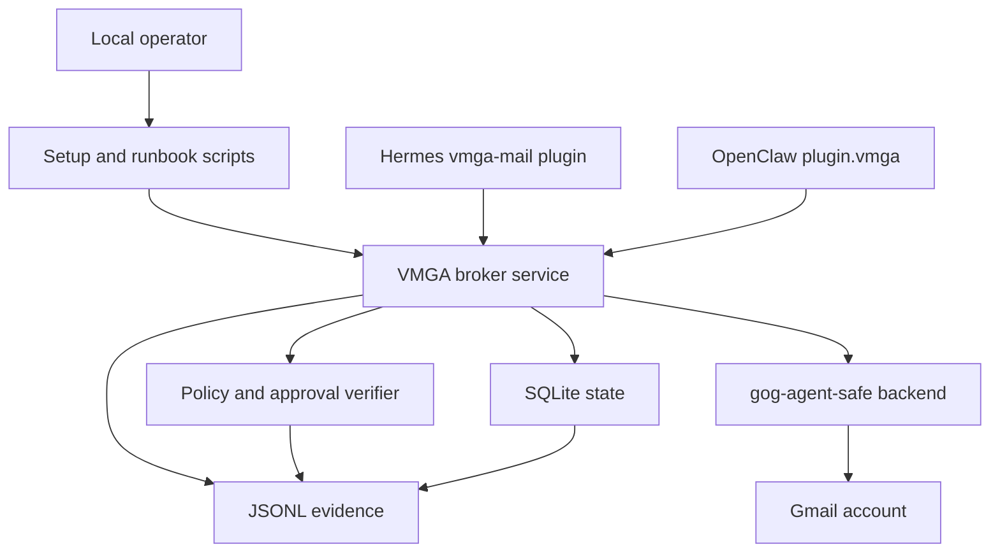
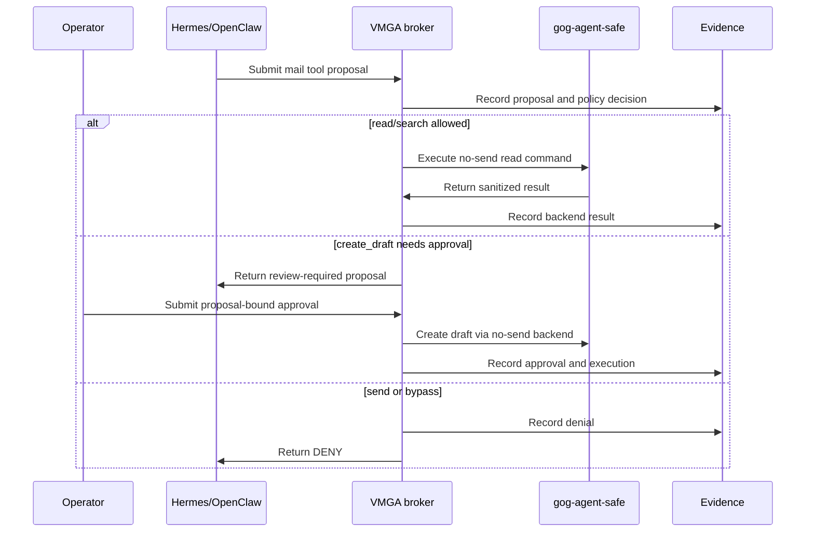

# feat: Finish VMGA operator readiness

## Summary

VMGA now has the core broker, gogcli backend, Hermes plugin, OpenClaw plugin, approval-token CLI, evidence verifier, and CI scaffold. This plan closes the remaining gap between a working local smoke test and an operator-ready setup that can be installed, verified, recovered, and safely connected to Hermes and OpenClaw.

The target is a repeatable local production-adjacent deployment: VMGA runs as the mailbox control plane, agents call only VMGA broker-backed mail tools, and every Gmail side effect remains proposal-bound, approval-bound, and evidence-backed.

---

## Problem Frame

The repository has moved past the original production scaffold plans. The live local baseline already includes a healthy loopback VMGA broker, an authenticated gogcli account behind `gog-agent-safe`, an enabled Hermes `vmga-mail` plugin, and a loaded OpenClaw `plugin.vmga` plugin. The remaining risk is operational drift: important setup exists in local state and prior-session knowledge rather than in repeatable repo scripts, runbooks, verification commands, and tests.

OpenClaw is also not fully ready as a runtime. Its plugin is loaded, but the Gateway is not configured: gateway mode, token auth, command owner, and session-store readiness still need operator setup and evidence. Hermes is closer, but it still needs a documented smoke-test and bypass-check path that proves the enabled plugin is the mailbox surface and not merely another available tool.

---

## Requirements

- R1. A local operator can start, stop, inspect, and recover the VMGA broker without relying on undocumented prior-session commands.
- R2. The broker setup must preserve the current safety posture: gog runs behind VMGA, uses the agent-safe wrapper, defaults no-send, and keeps OAuth/keyring material outside agent-facing repo files.
- R3. Real-account Gmail checks must cover read/search and approved draft creation while proving that send remains denied.
- R4. Hermes setup must be verifiable from repo-owned commands or docs: plugin enabled, broker URL configured, tool calls fail closed when VMGA is unavailable, and kinetic tools return VMGA proposals or denials.
- R5. OpenClaw setup must distinguish plugin-loaded from Gateway-ready, then capture the required local Gateway, auth, command-owner, session, plugin, sandbox, secrets, and direct-bypass evidence.
- R6. Release evidence must include local runtime versions, broker health, policy hash, plugin status, gog auth health, safe smoke-test transcripts, and evidence verifier output without storing secrets or mailbox content in committed files.
- R7. Public docs must give a step-by-step real-account wiring path that uses placeholders and redaction rules, not the user's private account values.
- R8. Operator approval tooling must be sufficient for safe local use without requiring a full web console.
- R9. CI must continue to validate the repository without requiring live Gmail, Hermes, OpenClaw Gateway, or private local credentials.
- R10. Remaining production claims must stay bounded: the local setup is hard only to the extent credential isolation, bypass checks, and runtime evidence prove it.

---

## Key Technical Decisions

- **Treat the broker as the operational center:** The remaining work should improve broker operations, evidence, and integration checks rather than adding alternate Gmail access paths. Hermes and OpenClaw stay thin broker clients.
- **Keep real-account wiring local but documented:** Repo artifacts should describe how to configure OAuth, keyring, launchd, and broker environment files, but committed examples must use placeholders and redaction guidance.
- **Use gogcli only as a backend dependency:** The agent-safe gog binary remains a broker implementation detail. Hermes, OpenClaw, MCP, shell, and browser surfaces must not receive direct gog access for mailbox actions.
- **Make OpenClaw readiness evidence-based:** A loaded plugin is not Gateway readiness. The plan requires explicit `doctor`, security, secrets, sandbox, approvals, plugin, and direct-bypass checks before OpenClaw is considered wired.
- **Add small operator tooling before any UI:** A CLI/admin workflow for listing proposals, generating approval tokens, executing approved drafts, and verifying evidence is enough for local use. A browser approval console is follow-up work.
- **Separate live smoke tests from CI tests:** CI should mock gog, Hermes, and OpenClaw. Live smoke tests should be documented or scripted behind opt-in flags and write artifacts under ignored local evidence directories.

---

## High-Level Technical Design

---

## Scope Boundaries

### In Scope

- Repeatable local broker service setup, restart, health, and recovery guidance.
- Real-account gog backend setup docs and opt-in smoke-test scripts.
- Hermes plugin verification and fail-closed smoke tests.
- OpenClaw Gateway readiness checklist, evidence capture, and plugin verification.
- Operator CLI/admin affordances for proposal inspection, approval, execution, and evidence verification.
- Release evidence packaging and redaction rules.
- CI-safe tests for command construction, tool adapters, docs, examples, and release checks.

### Deferred to Follow-Up Work

- Public or remote OpenClaw exposure beyond a secure local/operator baseline.
- Full browser approval console, multi-approver workflows, or mobile approval flows.
- KMS/HSM-backed approval verification and hardware-backed credential isolation.
- Attachment sandboxing, malware detonation, and DLP.
- Multi-account or multi-mailbox routing beyond one operator-owned Gmail account.
- Packaging the OpenClaw plugin for registry distribution.

### Out of Scope

- Granting Hermes or OpenClaw direct Gmail, gog, gws, browser-session, shell, MCP, or native Workspace write access outside VMGA.
- Claiming VMGA secures Hermes internals, OpenClaw internals, host compromise, prompt injection, browser isolation, or compliance posture.
- Committing local OAuth client secrets, keyring passwords, broker HMAC secrets, mailbox identifiers, or raw mailbox content.

---

## Implementation Units

### U1. Make Local Broker Operations Repeatable

- **Goal:** Turn the working launchd broker setup into documented, repeatable operator workflows.
- **Requirements:** R1, R2, R6, R7, R10
- **Dependencies:** None
- **Files:** `docs/deployment_runbook.md`, `README.md`, `examples/broker_local.yaml`, `scripts/vmga_release_check.py`, `tests/test_release_checks.py`
- **Approach:** Add a local broker operations section that covers environment file shape, launchd/service wrapper expectations, restart/health inspection, log locations by role, policy/state/evidence permissions, and recovery from failed health checks. Keep values generic and explicitly route secrets to ignored local paths outside the repo.
- **Patterns to follow:** Existing `Broker Mode` README section, `docs/deployment_runbook.md` precondition language, and `scripts/vmga_release_check.py` safe-file scanning.
- **Test scenarios:**
  - Release check fails if committed examples contain real-looking Google OAuth tokens, approval secrets, or personal mailbox identifiers.
  - Docs mention the broker health check, state path, ledger path, and policy path without embedding local secret values.
  - Example broker config remains parseable and uses placeholder values only.
- **Verification:** A fresh operator can follow the runbook to identify whether the broker is running, healthy, in lockdown, or missing required dependencies.

### U2. Add Real-Account Gog Backend Smoke Tests

- **Goal:** Provide opt-in real-account validation that proves search/read and approved draft creation work while send remains denied.
- **Requirements:** R2, R3, R6, R7, R9
- **Dependencies:** U1
- **Files:** `scripts/vmga_live_smoke.py`, `docs/gmail_backend_options.md`, `docs/evidence.md`, `tests/test_gogcli_backend.py`, `tests/test_release_checks.py`
- **Approach:** Add an opt-in smoke script that calls the broker rather than gog directly. It should check health, submit a read/search proposal, submit a draft proposal to a configured safe recipient, require an approval token path, execute the approved draft, verify evidence, and attempt or simulate a send denial. The script must redact message content and account identifiers in any saved transcript.
- **Execution note:** Keep live tests disabled by default and make the unit tests mock broker/gog responses.
- **Patterns to follow:** `scripts/build_vmga_evidence.py`, `scripts/verify_vmga_evidence.py`, and gog backend subprocess tests.
- **Test scenarios:**
  - Unit test with a fake broker proves the smoke script refuses to run without an explicit live flag.
  - Search smoke records an allow/read backend result without requiring a real Gmail response in CI.
  - Draft smoke requires an approval token before execution.
  - Send smoke expects `DENY` even when the account is authenticated.
  - Transcript redaction removes configured email addresses, OAuth-looking tokens, and draft body content.
- **Verification:** The live smoke produces a redacted local transcript and a valid evidence JSONL file when run by an operator with configured credentials.

### U3. Improve Operator Approval And Proposal Inspection

- **Goal:** Make proposal review and approved execution usable from the CLI without hand-building JSON payloads.
- **Requirements:** R1, R3, R6, R8
- **Dependencies:** U1
- **Files:** `src/vmga/cli.py`, `src/vmga/sqlite_state.py`, `src/vmga/broker.py`, `README.md`, `tests/test_vmga_contract.py`, `tests/test_vmga_adapter.py`
- **Approach:** Add focused CLI commands or subcommands for listing pending proposals, showing proposal binding fields, generating a proposal-bound approval token, approving a proposal, executing an approved proposal, and printing safe evidence references. Keep raw HMAC secrets read from environment only and avoid printing tokens unless explicitly requested.
- **Patterns to follow:** Existing `vmga-approval-token` behavior, broker `/v1/approvals` and `/v1/executions` handlers, and SQLite state APIs.
- **Test scenarios:**
  - Listing pending proposals shows proposal ID, action, actor, recipients count, message count, expiration, and status without raw content by default.
  - Show command can include full binding details only when an explicit verbose flag is used.
  - Approve command fails closed when the approval secret is missing.
  - Execute command refuses mismatched proposal hash or token and preserves approval single-use semantics.
  - CLI output supports JSON for scripts and concise text for operators.
- **Verification:** An operator can approve and execute a draft proposal using VMGA commands without crafting curl requests manually.

### U4. Finish Hermes Runtime Verification

- **Goal:** Convert the installed Hermes plugin into a repeatably verifiable VMGA mail surface.
- **Requirements:** R4, R6, R7, R9, R10
- **Dependencies:** U1, U2
- **Files:** `docs/hermes_integration.md`, `integrations/hermes/skills/vmga-mail/SKILL.md`, `integrations/hermes/tools.py`, `tests/test_integrations_static.py`, `tests/test_vmga_contract.py`
- **Approach:** Add a Hermes operator checklist that verifies plugin enablement, broker URL configuration, fail-closed behavior when the broker is missing, non-kinetic search through VMGA, draft proposal behavior, and absence of native Gmail/Workspace bypass tools in the mailbox-capable context. Tighten static tests so the plugin continues to avoid shell, browser, MCP, and direct Gmail dispatch.
- **Patterns to follow:** Existing `integrations/hermes/tools.py` fail-closed JSON handlers and `docs/hermes_integration.md` bypass checklist.
- **Test scenarios:**
  - Handler returns `DENY` when `VMGA_BROKER_URL` is missing.
  - Handler returns `DENY` when the broker is unreachable.
  - Search and draft handlers send proposals to `/v1/proposals` only.
  - Static test fails if Hermes plugin code imports subprocess, dispatches terminal/browser/MCP tools, or references direct Gmail tokens.
  - Docs include a redacted smoke-test transcript shape without real mailbox content.
- **Verification:** Hermes can call VMGA-backed `mail_search` and `mail_create_draft`, and the runbook can prove kinetic tools do not bypass VMGA.

### U5. Finish OpenClaw Gateway Readiness

- **Goal:** Move OpenClaw from plugin-loaded to local Gateway-ready with explicit security evidence.
- **Requirements:** R5, R6, R7, R9, R10
- **Dependencies:** U1, U2
- **Files:** `docs/openclaw_integration.md`, `docs/deployment_runbook.md`, `examples/openclaw_gateway_vmga.yaml`, `integrations/openclaw/README.md`, `integrations/openclaw/src/index.test.ts`, `tests/test_integrations_static.py`
- **Approach:** Document and test the local readiness sequence: configure gateway mode, enable token auth, set command owner, create or validate session storage, inspect `plugin.vmga`, run security and secrets checks, capture sandbox and approvals posture, and prove non-VMGA Gmail write paths are unavailable. Keep public/remote exposure deferred until the same checks are clean under an identity-aware ingress.
- **Patterns to follow:** Existing OpenClaw integration notes, OpenClaw plugin package scripts, and release checklist security-watchpoint language.
- **Test scenarios:**
  - OpenClaw plugin tests prove all mail tools post only to the VMGA broker and never call Gmail/gog/shell directly.
  - Static tests fail if examples expose direct `gog`, `gws`, native Gmail, browser write, or terminal write paths in mailbox-capable agent config.
  - Docs distinguish `plugin.vmga` loaded from Gateway-ready and require `doctor` remediation before exposure.
  - Release check requires OpenClaw evidence slots for doctor, security audit, secrets audit, sandbox explain, approvals, plugin inspect, and direct-bypass denial.
- **Verification:** A local OpenClaw operator can produce redacted evidence showing the Gateway is configured, authenticated, plugin-loaded, and not exposing direct mailbox write tools.

### U6. Package Release Evidence And Redaction

- **Goal:** Make release evidence reproducible and safe to share.
- **Requirements:** R6, R7, R9, R10
- **Dependencies:** U2, U4, U5
- **Files:** `scripts/build_vmga_evidence.py`, `scripts/verify_vmga_evidence.py`, `scripts/vmga_release_check.py`, `docs/evidence.md`, `docs/release_checklist.md`, `tests/test_release_checks.py`
- **Approach:** Extend the evidence builder or add a release-evidence collection mode that stores redacted command outputs, tool versions, broker health, policy/config hashes, plugin status, gog auth health, live smoke summaries, and verifier results. Keep raw secrets and mailbox content out of artifacts by default.
- **Patterns to follow:** Existing dry-run evidence artifact under ignored output paths and `ReleaseReport` JSON shape.
- **Test scenarios:**
  - Evidence collector refuses to include files outside approved artifact roots.
  - Redaction removes configured emails, bearer tokens, HMAC-like values, OAuth token patterns, and draft body text.
  - Verifier accepts evidence with allow, deny, review-required, approval, execution, and broker-health records.
  - Release check fails when required evidence slots are absent for a claimed live deployment.
- **Verification:** Running the release-evidence workflow produces a shareable redacted bundle and a machine-readable verification result.

### U7. Tighten Packaging And Fresh-Clone Installability

- **Goal:** Ensure the repo remains installable and usable from a clean checkout after the local setup work is documented.
- **Requirements:** R1, R4, R5, R9
- **Dependencies:** U1, U4, U5
- **Files:** `pyproject.toml`, `README.md`, `.gitignore`, `integrations/openclaw/package.json`, `integrations/openclaw/README.md`, `.github/workflows/ci.yml`, `tests/test_release_checks.py`
- **Approach:** Verify console scripts install after editable setup, document OpenClaw plugin build-before-link requirements, keep generated `dist` and `node_modules` ignored, and make CI cover Python tests plus OpenClaw package validation where feasible without live Gateway credentials.
- **Patterns to follow:** Existing `pyproject.toml` script entries, OpenClaw `npm run plugin:validate`, and CI compile/test/release-check flow.
- **Test scenarios:**
  - Clean editable install exposes `vmga-broker`, `vmga-approval-token`, and `vmga-verify-evidence`.
  - OpenClaw package validation succeeds after `npm install` in the integration directory.
  - Release check warns or fails if docs imply committed `dist` is required for source distribution.
  - `.gitignore` continues to exclude local state, evidence, secrets, `node_modules`, and generated plugin output.
- **Verification:** A clean clone can install Python tooling, build the OpenClaw plugin, run tests, and follow docs without private local files.

---

## System-Wide Impact

This plan mainly affects operational surfaces rather than VMGA's core approval model. The most important system-wide effect is reducing undocumented local state: broker service configuration, real-account smoke tests, plugin setup, and evidence collection become reproducible artifacts. That improves open-source adoption while keeping the hard-enforcement claim tied to deployment proof.

The plan also strengthens the boundary between VMGA and host agents. Hermes and OpenClaw remain client surfaces, while gog and Gmail credentials stay broker-side. Any future work that exposes direct Workspace tools to agents should be treated as a VMGA bypass unless it routes through the proposal and execution gate.

---

## Risks & Dependencies

- **Google OAuth testing state can drift:** Gog authorization depends on the OAuth app and tester list. The live smoke path should surface auth failures clearly without weakening CI.
- **OpenClaw configuration may be machine-specific:** Gateway mode, auth, command owner, channel identity, and session paths are operator choices. Docs should provide exact checks and placeholders rather than hard-coded local identities.
- **Live smoke tests can create real drafts:** The smoke script must require explicit confirmation, use a configured safe recipient, and state that draft creation is real even though send remains denied.
- **Evidence can leak mailbox data:** Redaction must be default-on for shareable evidence bundles, and raw local logs should remain ignored.
- **Hermes and OpenClaw versions will move:** Release evidence should record versions under test and keep docs scoped to observed controls rather than broad claims.

---

## Documentation / Operational Notes

Update public docs only with generic setup steps and placeholders. Keep private local paths, account names, OAuth client material, keyring passwords, broker secrets, and raw transcript content out of committed files. When docs need to mention local files, use role-based names such as "operator-owned gog config root" or "ignored broker environment file" rather than this machine's private values.

Use ignored local artifact directories for live evidence. Public examples should remain safe defaults that run with the fake backend unless the operator opts into real-account setup.

---

## Sources & Research

- `docs/plans/2026-06-09-002-vmga-full-gambit-plan.md` defines the broker, gogcli, Hermes, OpenClaw, evidence, and release-readiness target.
- `README.md`, `docs/deployment_runbook.md`, `docs/hermes_integration.md`, and `docs/openclaw_integration.md` define the current claim boundaries and bypass checklists.
- `src/vmga/backends/gogcli.py`, `src/vmga/broker.py`, `src/vmga/cli.py`, `integrations/hermes/tools.py`, and `integrations/openclaw/src/index.ts` define the current implementation surfaces.
- Local runtime checks on 2026-06-10 showed a healthy VMGA broker, enabled Hermes `vmga-mail`, loaded OpenClaw `plugin.vmga`, and OpenClaw Gateway readiness gaps in mode, token auth, command owner, and session store.
